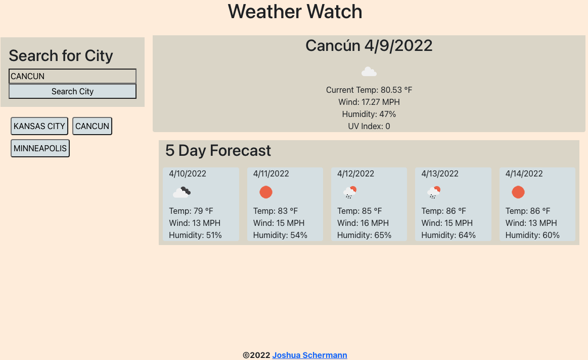

# Weather Watch
React Application for retrieving weather data for anywhere in the world. 

Deployment: deployment here

## Table of Contents

- [Installation](#installation)
- [Usage](#usage)
- [License](#license)
- [Contributions](#contributions)
- [Technologies](#technologies)
- [Credits](#credits)
- [Questions](#questions)

## Installation

Use "npm install" to install required modules for this application. Enter "npm run start" to launch the react app. 

## Usage

Enter a city in the search bar, click search or hit enter. Current weather is displayed, along with a 5 day forecast. 

## License

This project is licensed under the MIT license.

## Contributions

Fork the project and create a pull request. Let us know how you think you can contribute!

## Technology Used

  
  

## Credits

Created by Joshua Schermann.

## Questions

Post an issue if you see a bug or suggested improvement. 